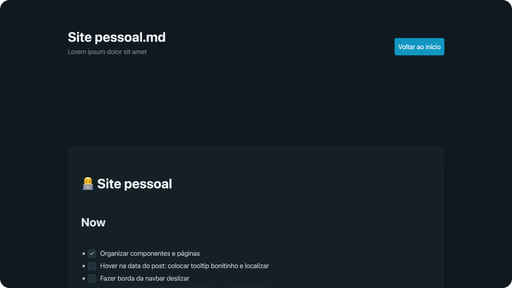

<h1 align="center">My public TO-DOs</h1>

  This is a read-only mirror of my TO-DO lists for some of my active public projects. Powered by <a href="https://kit.svelte.dev">SvelteKit</a>, <a href="https://picocss.com">Pico</a> and <a href="https://mega.js.org">MEGA</a>.

  

